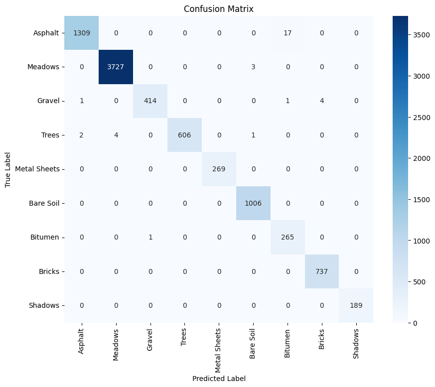
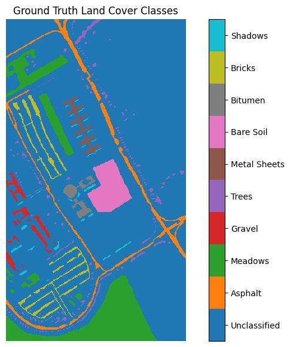
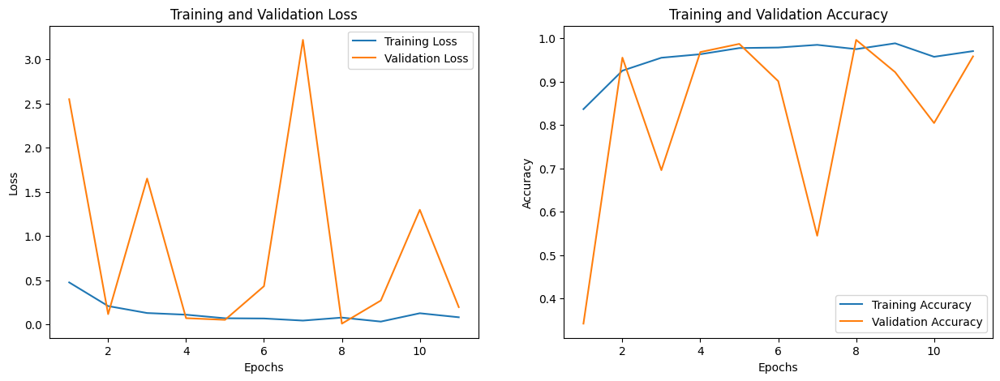
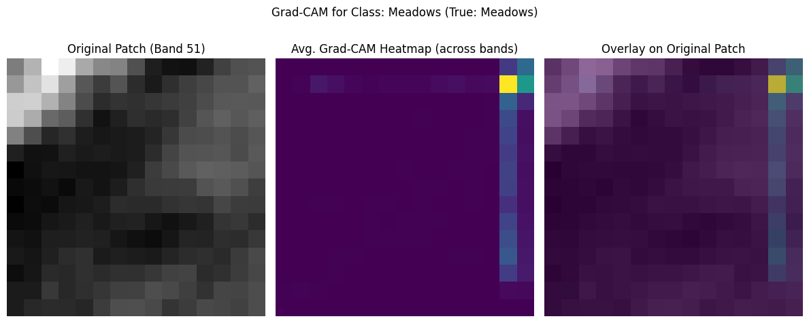

# Urban Land Cover Classification using Attentive 3D CNN on Hyperspectral Imagery

## Project Overview
This project implements an advanced deep learning model for urban land cover classification using the Pavia University hyperspectral dataset. It features a 3D Convolutional Neural Network (CNN) enhanced with custom Spectral and Spatial Attention mechanisms to accurately classify various urban land cover types. The project also incorporates Explainable AI (XAI) using 3D Grad-CAM to provide insights into the model's decision-making process.

**Key Features:**
*   3D CNN architecture tailored for hyperspectral data.
*   Integrated Spectral Attention (SE-like) and Spatial Attention modules.
*   High classification accuracy (99.60% OA) on the Pavia University benchmark.
*   Explainable AI using 3D Grad-CAM visualizations.
*   Implemented in Python with PyTorch.

## Table of Contents
*   [Introduction](#introduction)
*   [Dataset](#dataset)
*   [Methodology](#methodology)
    *   [Data Preprocessing](#data-preprocessing)
    *   [Model Architecture](#model-architecture)
    *   [Training](#training)
*   [Results](#results)
    *   [Quantitative Metrics](#quantitative-metrics)
    *   [Visualizations](#visualizations)
*   [Explainable AI (XAI)](#explainable-ai-xai)
*   [Setup and Usage](#setup-and-usage)
*   [Future Work](#future-work)
*   [Acknowledgements](#acknowledgements)
*   [License](#license)

## Introduction
Effective urban planning, infrastructure management, and environmental monitoring in rapidly evolving cities demand precise and up-to-date land cover information. Traditional imaging methods often fall short in capturing the intricate details of diverse urban surfaces. Hyperspectral Imaging (HSI) provides a powerful solution by recording detailed spectral fingerprints for each pixel, enabling the identification of specific materials and conditions. Recognizing this potential, the objective of this project was to create a highly accurate and interpretable deep learning model—a 3D CNN with integrated spectral and spatial attention—capable of classifying urban land cover types from HSI data with high fidelity, thereby providing actionable insights for smarter urban management.

## Dataset
*   **Name:** Pavia University
*   **Source:** [https://www.ehu.eus/ccwintco/index.php/Hyperspectral_Remote_Sensing_Scenes]
*   **Details:** Spatial dimensions (610x340), 103 spectral bands, 9 ground truth classes.
*   The raw dataset is not included in this repository due to size and should be downloaded from the source.

## Methodology

### Data Preprocessing
*   Normalization.
*   Patch extraction (e.g., 15x15x103).
*   Train/Validation/Test split.

### Model Architecture

Our model, `Attentive3DCNN`, is designed to effectively process hyperspectral image patches by learning discriminative spectral-spatial features. It consists of a 3D CNN backbone augmented with specialized attention mechanisms.

*   **3D CNN Backbone:**
    The core of the network is built using a sequence of 3D convolutional layers (`nn.Conv3D`). These layers are adept at simultaneously processing spatial dimensions (height, width of the patch) and the spectral dimension (the 103 bands). Each convolutional block typically includes:
    1.  A `nn.Conv3D` layer to extract features. Kernel sizes are chosen to capture local spectral-spatial patterns (e.g., `(7,3,3)` for initial layers, adapting for spectral depth in later layers).
    2.  `nn.BatchNorm3d` for stabilizing training and accelerating convergence.
    3.  `nn.ReLU` activation function to introduce non-linearity.
    The backbone progressively transforms the input patch into higher-level feature representations. A `nn.MaxPool3d` layer is used after the main convolutional blocks to significantly reduce dimensionality before the fully connected layers.

*   **Spectral Attention Module (`SpectralAttention`):**
    This module is inspired by the Squeeze-and-Excitation (SE) block and is designed to adaptively recalibrate channel-wise feature responses. After an initial 3D convolutional block produces a set of feature maps `(N, C, D, H, W)`, the Spectral Attention module:
    1.  **Squeezes** global spatial-spectral information from each feature channel `C` by applying `AdaptiveAvgPool3d((1,1,1))`, resulting in a channel descriptor `(N, C)`.
    2.  **Excites** these descriptors through two fully connected layers (with a ReLU activation and a bottleneck reduction) to learn channel-specific importance weights.
    3.  Applies a `Sigmoid` function to these weights to scale them between 0 and 1.
    4.  **Rescales** the original input feature maps `(N, C, D, H, W)` by multiplying them with the learned channel weights, effectively emphasizing informative feature channels and suppressing less useful ones.

*   **Spatial Attention Module (`SpatialAttention`):**
    This module aims to highlight salient spatial-spectral regions within the feature maps `(N, C, D, H, W)`. It operates as follows:
    1.  Applies **average-pooling** and **max-pooling** operations across the channel dimension (`C`) independently, generating two distinct 3D feature descriptors: `(N, 1, D, H, W)` each, summarizing channel information.
    2.  These two descriptors are **concatenated** along the channel dimension, forming a `(N, 2, D, H, W)` feature map.
    3.  A **3D convolutional layer** (e.g., with a 3x3x3 kernel) is applied to this concatenated feature map to learn an effective combination, reducing it back to a single-channel 3D attention map `(N, 1, D, H, W)`.
    4.  A `Sigmoid` activation function is applied to this map to generate spatial attention weights between 0 and 1.
    5.  The original input feature maps `(N, C, D, H, W)` are then multiplied by this broadcasted 3D spatial attention map, selectively amplifying or suppressing features based on their spatial-spectral importance.

The strategic integration of these attention modules allows the network to dynamically focus on the most relevant spectral characteristics and spatial locations, leading to improved feature representation and classification performance.

---

### Training

The `Attentive3DCNN` model was trained using the following configuration and strategies:

*   **Loss Function:** `nn.CrossEntropyLoss` was employed as the objective function. This criterion is standard for multi-class classification tasks and combines `LogSoftmax` and `Negative Log Likelihood Loss (NLLLoss)` in one step, making it suitable for models outputting raw scores (logits) per class.

*   **Optimizer:** The `Adam` optimizer (Adaptive Moment Estimation) was used to update the model weights. Adam is an efficient and popular optimization algorithm that adapts learning rates for each parameter.
    *   **Learning Rate:** An initial learning rate of `0.001` was set.
    *   **Weight Decay:** A weight decay (L2 regularization) of `1e-5` was applied to help prevent overfitting by penalizing large weights.

*   **Training Parameters:**
    *   **Batch Size:** Data was fed to the model in batches of `64` patches.
    *   **Epochs:** The model was set to train for a maximum of `50` epochs. *(Note: Actual training stopped at epoch 11 due to early stopping).*

*   **Learning Rate Scheduler:** A `ReduceLROnPlateau` scheduler was utilized. This scheduler monitors the validation loss and reduces the learning rate (by a factor of `0.2`) if the validation loss does not improve for a specified `patience` of 5 epochs. This helps in fine-tuning the model when it's close to an optimal solution.

*   **Early Stopping Strategy:** To prevent overfitting and save computational resources, an early stopping mechanism was implemented.
    *   The strategy monitored the validation loss after each epoch.
    *   If the validation loss did not show improvement for a defined number of consecutive epochs (`patience = 10`), the training process was halted.
    *   The model weights corresponding to the epoch with the best (lowest) validation loss observed during training were saved and subsequently used for final evaluation on the test set. In this project, training stopped after 11 epochs due to this strategy.

## Results

### Quantitative Metrics
*   Overall Accuracy (OA): **99.60%**
*   Kappa Coefficient (Κ): **0.9947**
*   

### Visualizations
*   
*   

## Explainable AI (XAI)


To gain insights into our `Attentive3DCNN` model's decision-making process and understand which input features contribute most to its predictions, we implemented an explainability technique called **3D Gradient-weighted Class Activation Mapping (3D Grad-CAM)**.

*   **Briefly explain the use of 3D Grad-CAM:**
    3D Grad-CAM is an adaptation of the well-known Grad-CAM technique, specifically tailored for models processing volumetric data like our 3D hyperspectral patches (`(Bands, Height, Width)`). It helps visualize the regions within the input 3D patch that were most influential in determining a particular class prediction. The process involves:
    1.  **Targeting a Layer:** Selecting a late convolutional layer in the network (in our case, `model.relu3_a`, the output of the third convolutional block before aggressive pooling).
    2.  **Gradient Calculation:** Computing the gradients of the score for the target class with respect to the feature maps of this chosen target layer.
    3.  **Neuron Importance Weights:** These gradients are global average pooled across the feature map dimensions (Depth, Height, Width of the feature map) to obtain weights indicating the "importance" of each feature channel for the target class.
    4.  **Heatmap Generation:** A weighted combination of the forward-pass feature maps from the target layer is computed, using the neuron importance weights. This sum is then passed through a ReLU activation.
    The result is a 3D heatmap of the same dimensions as the target layer's feature maps (e.g., `(103, 15, 15)` in our case, matching the input patch's spectral and spatial dimensions). This heatmap highlights regions where high activations in important feature maps contributed to the classification of the target class. Brighter or "hotter" areas in the heatmap indicate higher importance.

    By visualizing this 3D heatmap (e.g., by averaging it spatially, overlaying it on the original patch, or viewing individual spectral slices), we can understand which specific spectral-spatial parts of the input patch the model "focused" on to make its prediction. This enhances model transparency and provides valuable diagnostic information.


    

## Setup and Usage

### Prerequisites
*   Python 3.x
*   PyTorch
*   numpy
*   scipy
*   torch
*   torchvision
*   scikit-learn
*   matplotlib
*   seaborn
*   tqdm
*   opencv-python 

### Installation
1.  Clone the repository:
    ```bash
    git clone https://github.com/YOUR_USERNAME/YOUR_REPOSITORY_NAME.git
    cd YOUR_REPOSITORY_NAME
    ```
2.  Create a virtual environment (recommended):
    ```bash
    python -m venv venv
    source venv/bin/activate  # On Windows: venv\Scripts\activate
    ```
3.  Install dependencies:
    ```bash
    pip install -r requirements.txt
    ```
4.  Download the Pavia University dataset:
    *   `PaviaU.mat` from [https://www.ehu.eus/ccwintco/index.php/Hyperspectral_Remote_Sensing_Scenes]
    *   `PaviaU_gt.mat` from [https://www.ehu.eus/ccwintco/index.php/Hyperspectral_Remote_Sensing_Scenes]


### Running the Code
*   To run your main Jupyter Notebook or script.
    ```bash
    jupyter notebook Urban_Land_Cover_Classification_Pavia.ipynb
    ```
*   `The pre-trained model weights are available in `best_attentive_3dcnn_model.pth`. The notebook is configured to load these for evaluation and XAI if the training cells are not re-run.`


## Future Work

Building upon the current model's strong performance, several innovative directions could be explored:

1.  **Enhanced Robustness to Atmospheric Variations & Cross-Sensor Generalization:**
    *   Investigate the model's sensitivity to diverse atmospheric conditions (e.g., varying aerosol loads, water vapor).
    *   Develop adaptive pre-processing modules or augment the existing attention mechanisms to dynamically learn and compensate for atmospheric distortions directly from the hyperspectral data, improving classification consistency across different acquisition times and potentially different HSI sensors.

2.  **Urban Material Degradation Analysis using Fine-Grained Spectral Features:**
    *   Extend the classification task to identify not just material types but also their condition or relative age (e.g., weathered asphalt, aging roofing materials).
    *   Leverage the model's spectral sensitivity and XAI (3D Grad-CAM spectral slice analysis) to pinpoint subtle spectral shifts indicative of material degradation due to environmental exposure, potentially enabling targeted infrastructure maintenance planning.

3.  **Micro-Scale Urban Heat Island (UHI) Contribution Mapping:**
    *   Integrate the high-resolution land cover classification map produced by this model with thermal infrared imagery (if available).
    *   Develop a fusion model to estimate land surface temperatures (LST) and analyze the differential contribution of various classified urban materials (e.g., dark roofs, green spaces, specific pavement types) to local UHI effects, providing detailed insights for urban climate mitigation strategies.

## Acknowledgements

*   Pavia University dataset providers.
